# Backend Documentation

## Overview

This backend system is built with Flask and provides a RESTful API for managing projects, tasks, and users. It includes authentication, database models, and migration support.


## Project Structure

```bash
backend/
├── app/
│ ├── routes/ 		# API endpoint definitions
│ ├──  init .py 	# Flask application factory
│ ├── config.py 	# Configuration settings
│ ├── models.py 	# Database models
│ └── schemas.py 	# Marshmallow schemas
├── migrations/ 	# Database migration scripts
├── test/ 		# Unit tests
├── requirements.txt 	# Python dependencies
└── run.py 		# Application entry point
```

## ✨Key Features

### 🔐Authentication

- JWT-based authentication
- User registration and login endpoints
- Password hashing
- Role-based access control

### 📦Core Components

| Component         | Description                       |
| ----------------- | --------------------------------- |
| **Models**  | User, Project, Task               |
| **Schemas** | Data validation and serialization |
| **Routes**  | REST API endpoints                |

### 🗃️Database Models

```mermaid
erDiagram
    USER {
        int id PK
        string username
        string email
        text password_hash
        bool is_admin
    }
    PROJECT {
        int id PK
        string title
        text description
        datetime created_at
        int manager_id FK
    }
    TASK {
        int id PK
        text description
        string status
        string priority
        date due_date
        datetime created_at
        int project_id FK
        int owner_id FK
    }
    PROJECT_MEMBERS {
        int user_id FK
        int project_id FK
    }

    %% Relaciones Usuario ↔ Proyecto (gestiona y pertenece)
    USER ||--o{ PROJECT : manages
    USER }|..|{ PROJECT_MEMBERS : "invited_projects ⇄ members"
    PROJECT ||--o{ PROJECT_MEMBERS : ""
  
    %% Relaciones Proyecto ↔ Tarea
    PROJECT ||--o{ TASK : contains

    %% Relaciones Usuario ↔ Tarea
    USER ||--o{ TASK : owns
```



## 🚀API Endpoints

### 👥Users

| Endpoint                | Method | Description              |
| ----------------------- | ------ | ------------------------ |
| `/api/users/register` | POST   | Register new user        |
| `/api/users/login`    | POST   | Login and get JWT token  |
| `/api/users/me`       | GET    | Get current user profile |
| `/api/users/get`      | GET    | List all users           |

### 📂Projects

| Endpoint                      | Method | Description                |
| ----------------------------- | ------ | -------------------------- |
| `/api/projects`             | POST   | Create new project         |
| `/api/projects`             | GET    | List user's projects       |
| `/api/projects/<id>`        | GET    | Get project details        |
| `/api/projects/<id>`        | PUT    | Update project             |
| `/api/projects/<id>`        | DELETE | Delete project (and tasks) |
| `/api/projects/<id>/invite` | POST   | Invite one or more users   |

### ✅Tasks

| Endpoint            | Method | Description       |
| ------------------- | ------ | ----------------- |
| `/api/tasks`      | POST   | Create new task   |
| `/api/tasks`      | GET    | List user's tasks |
| `/api/tasks/<id>` | GET    | Get task details  |
| `/api/tasks/<id>` | PUT    | Update task       |
| `/api/tasks/<id>` | DELETE | Delete task       |

## 🛠️Getting Started

### Prerequisites

- Python 3.8+
- PostgreSQL
- Python3-venv

### Installation

To install the project locally, simply run the `setup_local_dev.sh` script located in the root directory.

### Dependencies

Full list in `requirementes.txt`

### Running the Application

```
flask run
```

### Testing

```
pytest test/
```

## 🚀Deployment

The application is configured for deployment on AWS with:

* Gunicorn as WSGI server
* PostgreSQL database
* Environment-based configuration

## 🔒Security Features

* JWT authentication
* Password hashing
* Role-based access control
* Secure database configuration
* Environment variable protection
