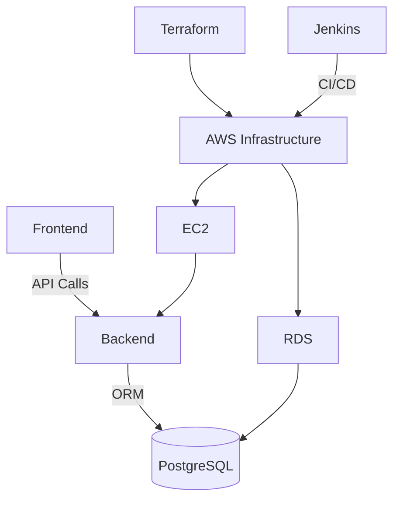
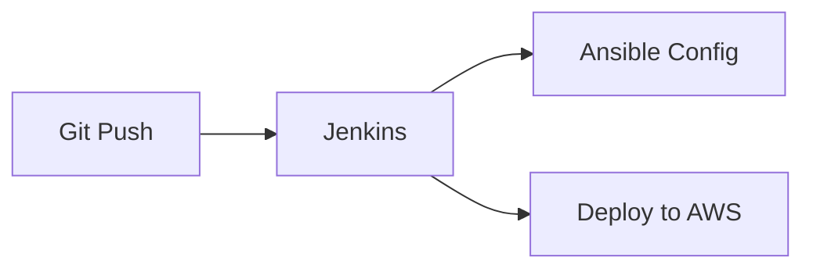
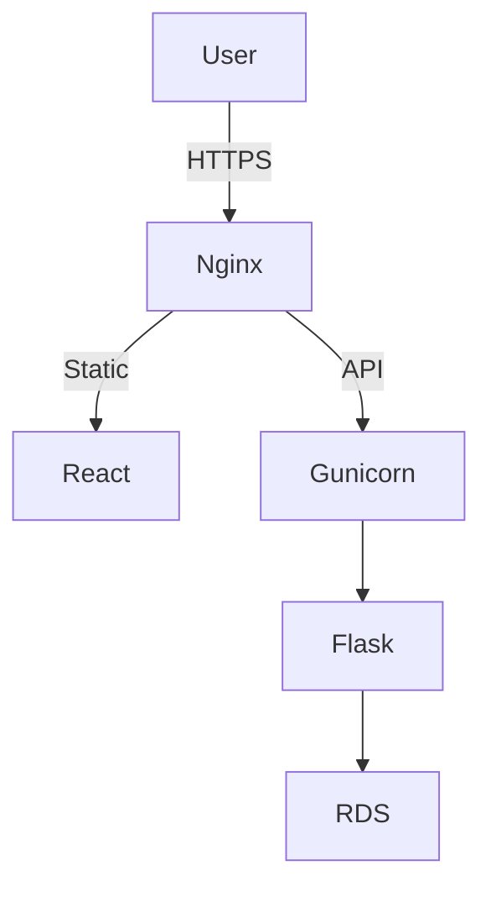

# DevPilot - Project Management System


## Overview

DevPilot is a full-stack project management solution featuring:

- 🚀React frontend with Vite
- 🐍Flask REST API backend
- 🗄️PostgreSQL database
- ☁️AWS infrastructure as code
- 🔄CI/CD pipeline



## 📂Project Structure

```
.
├── Backend/          	# Flask application
├── frontend/         	# React application
├── infra/            	# Infrastructure as Code
│   ├── ansible/      	# Configuration management
│   └── terraform/    	# AWS provisioning
├── setup_local_dev.sh 	# Local development script
└── Jenkinsfile     	# CI/CD pipeline
```

## 🛠️Quick Start

### Local Development

```
# Run setup script
chmod +x setup_local_dev.sh
./setup_local_dev.sh

# Follow the interactive prompts
```

## 🔗Component Documentation

| Component                | Description              | Documentation                                       |
| ------------------------ | ------------------------ | --------------------------------------------------- |
| **Frontend**       | React application        | [frontend/README.md](frontend/README.md)               |
| **Backend**        | Flask REST API           | [Backend/README.md](Backend/README.md)                 |
| **Infrastructure** |                          |                                                     |
| ├─**Terraform**  | AWS provisioning         | [infra/terraform/README.md](infra/terraform/README.md) |
| └─**Ansible**    | Configuration management | [infra/ansible/README.md](infra/ansible/README.md)     |

## 🧩Key Features

### Application

* JWT authentication
* Project/Task management
* Responsive UI
* RESTful API

### Infrastructure

* VPC with public/private subnets
* Auto-scaling EC2 instances
* Managed RDS PostgreSQL
* HTTPS with Let's Encrypt

## 🚧CI/CD Pipeline



### Jenkins Stages:

1. **Infrastructure Provisioning**
2. **Dependency Installation**
3. **Application Build**
4. **Deployment**

## 💻Local Development

### Requirements

* PostgreSQL 15+
* Python 3.10+
* Node.js 18+
* pgAdmin (optional)

### Setup Script Features

* Interactive database configuration
* Automatic environment setup
* Flask backend initialization
* React frontend launch
* VSCode auto-launch (optional)

## 🌐Production Architecture



## 🔒Security

* Environment variable protection
* RBAC implementation
* Network isolation
* Regular patching
* Automated certificate renewal

## 👥Team

[Juan José Jaramillo](https://github.com/ElzJuanjo)

[John Kider Álzate](https://github.com/Johnki1)

[José Andrés Daza](https://github.com/FoxyYTs)
