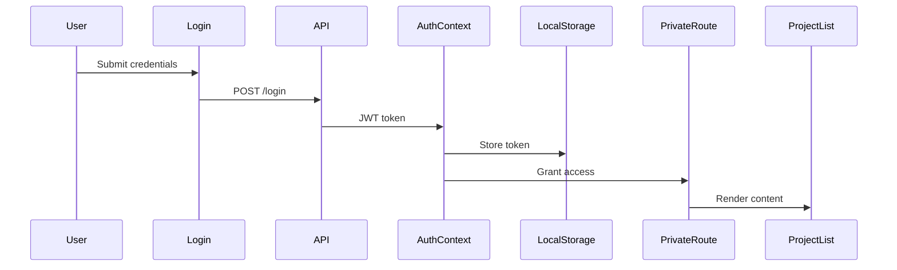
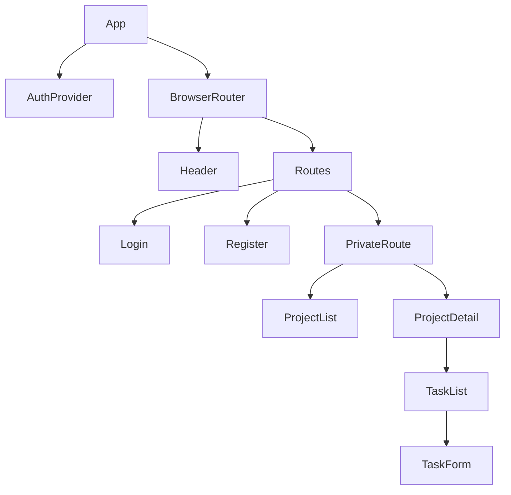
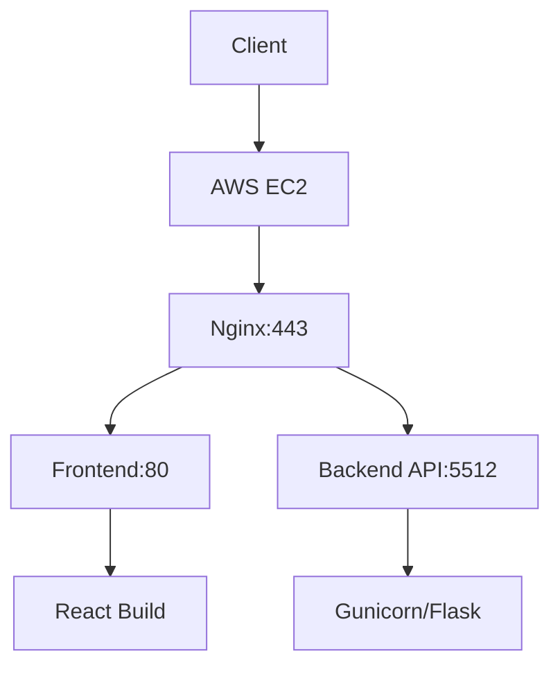

# Frontend Documentation

## Overview

A modern React application built with Vite for project management, featuring JWT authentication, responsive design, and seamless backend integration.


## Project Structure

```bash
frontend/
├── src/
│   ├── api/               # API configuration
│   ├── components/        # UI components
│   │   ├── auth/          # Authentication forms
│   │   ├── layout/        # App layout
│   │   ├── projects/      # Project management
│   │   └── tasks/         # Task management
│   ├── contexts/          # React contexts
│   └── App.jsx            # Root component
├── public/
├── .eslintrc.js           # ESLint configuration
└── package.json           # Dependencies
```

## ✨Key Features

### 🔐Authentication Flow



### 🧩Component Architecture



## 🛠️Getting Started

### Prerequisites

* Node.js 18+
* npm 9+

### Installation

To install the project locally, simply run the `setup_local_dev.sh` script located in the root directory.

### Dependencies

Full list in `package.json`

### Available Scripts

| Command             | Description              |
| ------------------- | ------------------------ |
| `npm run dev`     | Start development server |
| `npm run build`   | Create production build  |
| `npm run lint`    | Run ESLint checks        |
| `npm run preview` | Preview production build |

### Vite Features

* Lightning fast HMR
* SWC React plugin
* Production optimizations
* Environment variables support

## 🚀Deployment

### Infrastructure Overview



## 🔒 Security Features

* JWT authentication
* Protected routes
* Secure HTTP headers
* CSRF protection
* Form validation
* Error boundary handling
* SSL certificate
