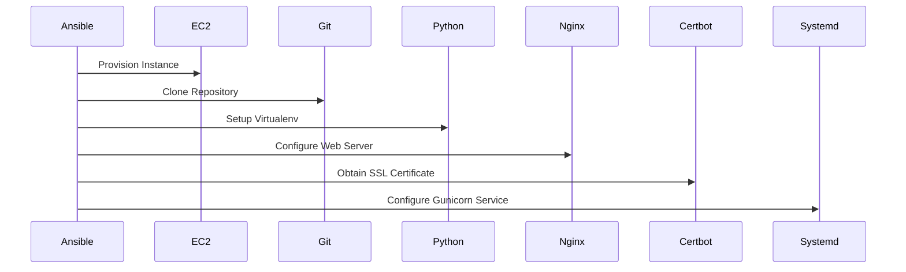
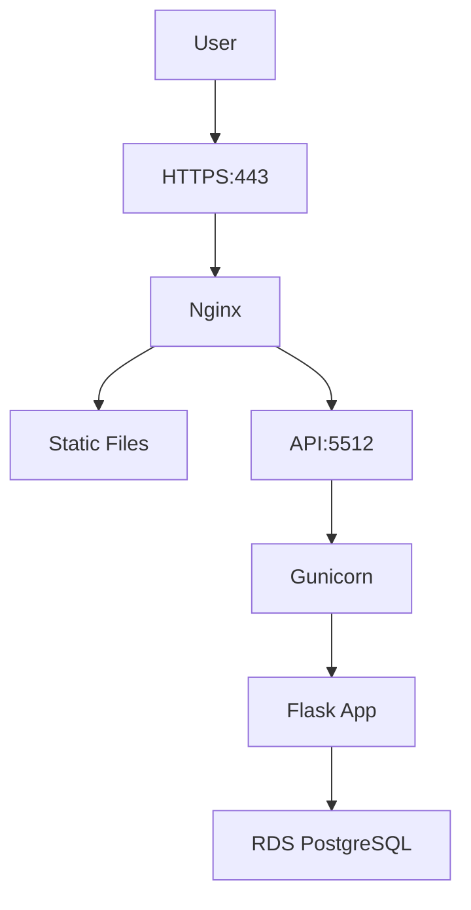

# Ansible Documentation

## Overview


Automated infrastructure provisioning for DevPilot application using Ansible playbooks to configure:

- ☁️ AWS EC2 instances
- 🌐 Nginx web server with HTTPS
- 🐍 Python/Flask backend
- ⚛️ React frontend
- 🔒 SSL certificates

## Project Structure

```bash
infra/ansible/
├── playbooks/
│   ├── webserver.yml    # Full stack deployment
│   └── dbserver.yml     # RDS connectivity checks
└── hosts.ini            # Inventory configuration
```

## 🔄 Deployment Workflow



## 🛠️ Playbook Details

### webserver.yml

 **Purpose** : Full stack deployment on EC2

 **Key Tasks** :

1. System package installation (Python, Node.js, Nginx)
2. Application cloning from GitHub
3. Backend setup:
   * Python virtual environment
   * Dependency installation
   * Database migrations
4. Frontend build
5. Nginx configuration (HTTP → HTTPS)
6. SSL certificate provisioning
7. Gunicorn service setup

### dbserver.yml

 **Purpose** : Verify RDS PostgreSQL connectivity

 **Checks Performed** :

* PostgreSQL client installation
* Database connection test
* Schema validation

## 🔒 Security Features

* Encrypted SSH access
* Minimal permission model (0600 for .env)
* Automated certificate renewal
* Secure Nginx configuration:
  * TLS 1.2/1.3 only
  * Secure cipher suites
  * HTTP → HTTPS redirect

## 🚀 Deployment Guide

### Prerequisites

* Ansible 2.14+
* AWS EC2 instance (Ubuntu 22.04)
* RDS PostgreSQL instance
* Domain name with DNS configured

### Execution

```
# Deploy full stack
ansible-playbook -i hosts.ini playbooks/webserver.yml

# Verify DB connection 
ansible-playbook -i hosts.ini playbooks/dbserver.yml
```

### Required Environment Variables

```
# Backend
export SECRET_KEY='your-secret-key'
export JWT_SECRET_KEY='your-jwt-secret'
export DB_USER='dbuser'
export DB_PASSWORD='dbpassword'
export RDS_ENDPOINT='your-rds.endpoint.rds.amazonaws.com'
```

### Service Management

```
# Check services
systemctl status gunicorn
systemctl status nginx

# View logs
journalctl -u gunicorn -f
tail -f /var/log/nginx/error.log
```

## 📊 Architecture Diagram


