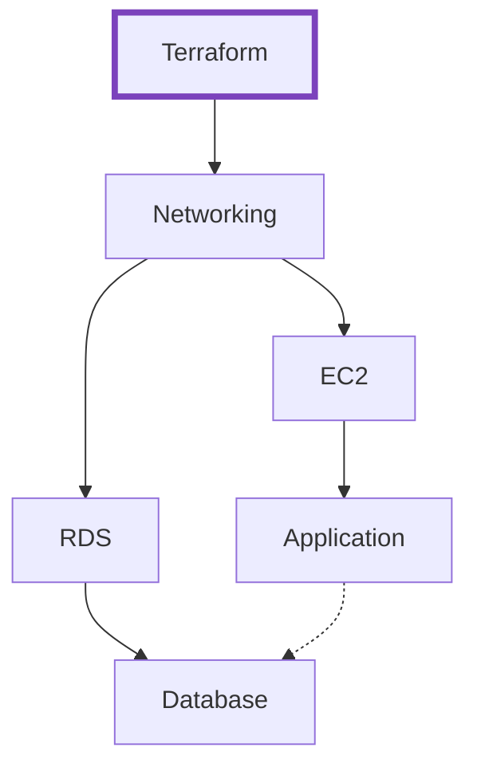
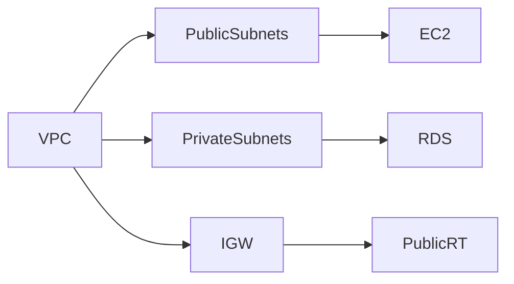
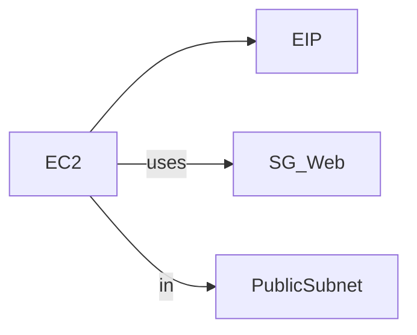
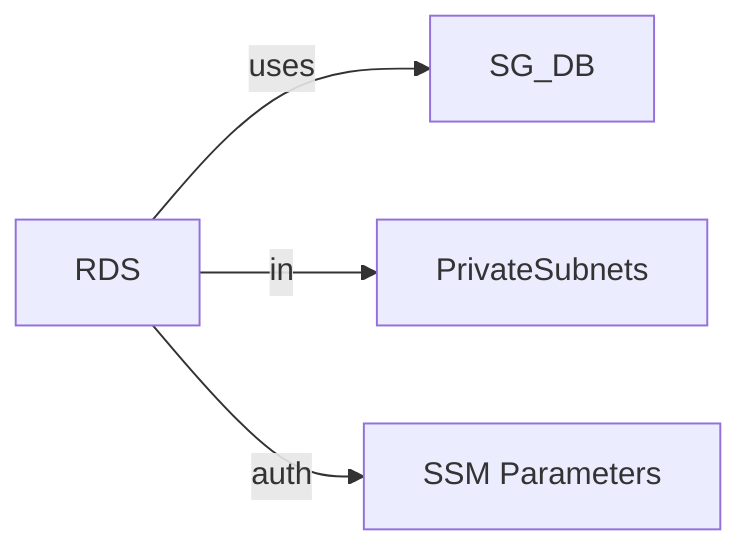

# Terraform Documentation

## Overview


Automated AWS infrastructure provisioning for DevPilot using Terraform modules:

- 🌐Networking (VPC, Subnets, Security Groups)
- 🖥️EC2 Instance (Application Host)
- 🗄️RDS PostgreSQL (Database)
- 🔒Secure State Management

## Project Structure

```bash
infra/terraform/
├── modules/
│   ├── ec2/          # Compute resources
│   ├── networking/   # Network infrastructure
│   └── rds/          # Database setup
├── backend.tf        # State configuration
├── main.tf           # Module orchestration
├── outputs.tf        # Output values
├── provider.tf       # AWS provider
└── variables.tf      # Input variables
```

## 📊Architecture Diagram



## 🧩Module Overview

### 1. Networking Module



**Components** :

* VPC with DNS support
* Public/Private subnets (2 AZs)
* Internet Gateway
* Security Groups:
  * Web (SSH/HTTP/HTTPS)
  * DB (PostgreSQL restricted access)

### 2. EC2 Module



**Configuration** :

* Instance Type: t2.micro
* AMI: Ubuntu 22.04 LTS
* Elastic IP attachment
* SSH key access

### 3. RDS Module



**Configuration** :

* Engine: PostgreSQL
* Instance: db.t3.micro
* Storage: 20GB
* Credentials via SSM Parameter Store

## 📋Input Variables

| Variable                | Type   | Default              | Description          |
| ----------------------- | ------ | -------------------- | -------------------- |
| `region`              | string | `us-east-1`        | AWS region           |
| `vpc_cidr`            | string | `10.0.0.0/16`      | VPC CIDR block       |
| `public_subnet_cidr`  | string | `10.0.1.0/24`      | Public subnet range  |
| `private_subnet_cidr` | string | `10.0.2.0/24`      | Private subnet range |
| `key_name`            | string | `dev-pilot-key`    | SSH key pair name    |
| `my_office_ip`        | string | `181.128.89.61/32` | Admin IP restriction |

## 🖇️Output Values

| Output           | Description                  | Sample Value                                                  |
| ---------------- | ---------------------------- | ------------------------------------------------------------- |
| `app_ec2_ip`   | Application public IP        | `52.202.178.61`                                             |
| `rds_endpoint` | Database connection endpoint | `devpilot-db.cq3csk2kkua9.us-east-1.rds.amazonaws.com:5432` |

## 🚀Deployment Guide

### Prerequisites

* Terraform 1.7+
* AWS CLI configured
* Terraform IAM profile
* SSH key pair created

### Execution

```
# Initialize
terraform init

# Plan
terraform plan -var="my_office_ip=$(curl -s ifconfig.me)/32"

# Apply
terraform apply -var="my_office_ip=$(curl -s ifconfig.me)/32"
```

## 🔒Security Features

* State file encryption in S3
* State locking via DynamoDB
* Credentials in SSM Parameter Store
* Minimal IP access rules
* Separate public/private subnets
* Database in private network
